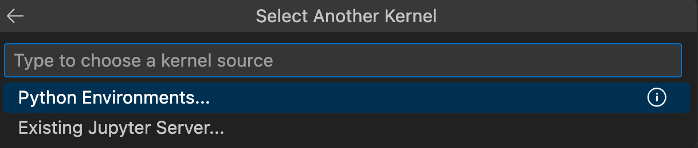
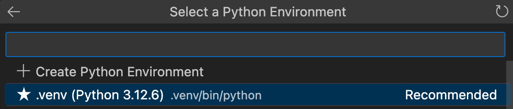

# VS Code and Jupyter/Python Projects

Generally we use VS Code as our code editor and the `uv` command-line tool to manage both Python installation and depencencies (e.g. installing pandas, altair, etc.).

Below is an overview of how to set up a new Python project where you plan to use Jupyter. 

> IMPORTANT: Make sure to first install VS Code [extensions](https://code.visualstudio.com/docs/editor/extension-marketplace) for [Jupyter](https://marketplace.visualstudio.com/items?itemName=ms-toolsai.jupyter) and [Python](https://marketplace.visualstudio.com/items?itemName=ms-python.python)

*Note, the below workflow builds on [these instructions](https://docs.astral.sh/uv/guides/integration/jupyter/#using-jupyter-from-vs-code) from the `uv` user manual.*

## Set up a Python project

> The following instructions assume you're using VS Code and the `uv` command-line tool.

On the command line or terminal shell, navigate to the folder where
you'd like to create your Python project.

Run the following commands:

```bash
# Create a new Python project
# (replace "my-python-project" with an appropriate name, obv)
uv create my-python-project

# Navigate to the new folder
cd my-python-project

# Add the Jupyter kernel to the project
uv add --dev ipykernel

# Add any other libraries you need. For example:
uv add pandas altair
```

There are a few ways to open the project in VS Code. 

From the command line, you can try one of the below options:

```bash
code .

# OR, if above doesn't work, try:

vscode .
```

Or you can simply open VS Code by clicking its icon in Applications or doing a Spotlight search, and then navigating to the newly created code project folder.


## Working with Jupyter in VS Code

Once VS Code is open, create a new Jupyter notebook by clicking on the appropriate icon in the top left corner of the window. 

> **Make sure the file has a `.ipynb` extension.**

Next, in the upper right of the notebook, click the `Select kernel` button and choose `Python Environments`.



Now choose the Python kernel installed by `uv` when you first set up the project. 

> Typically this will be named something like `.venv/bin/python` with an indication of the specific Python version in parentheses:


Test that you can import pandas:

Once selected, try importing `pandas` to verify that the kernel is properly connected to the `uv`-installed environment:

```python
import pandas as pd
```

If you see a green check mark, you're all good. 

